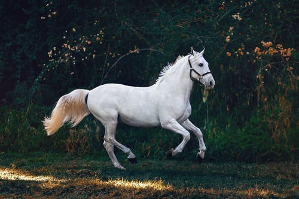
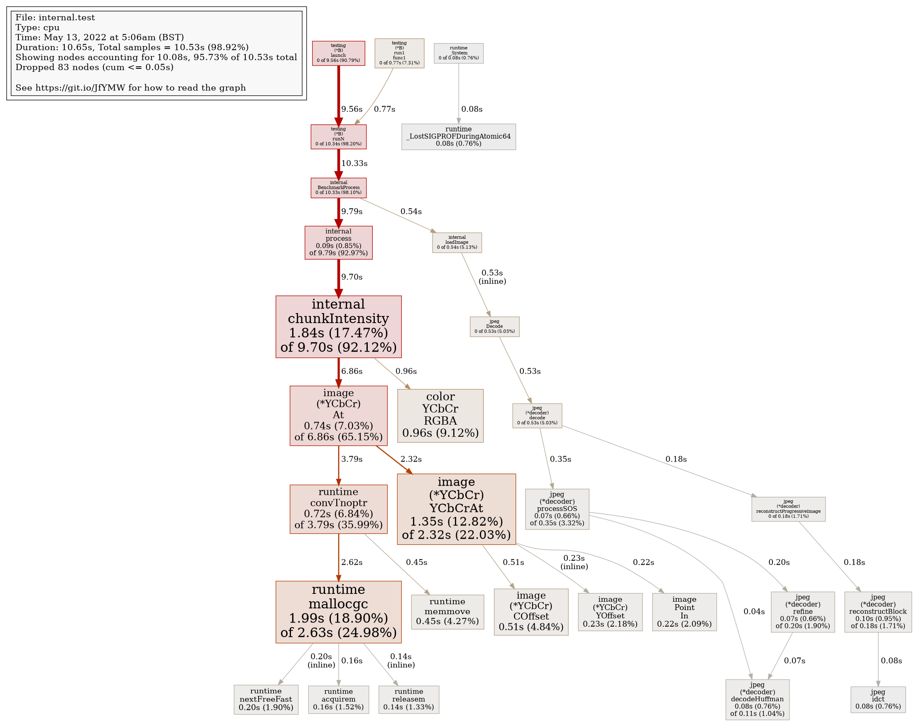

  <h3 align="center">Go-Pic2Text</h3>

  

    A CLI program written in Go to convert JPEG images into ASCII output.
    Refactor of an earlier project written in Ruby. Compilation time was much much longer in an interpreted
    language, and conversion to Golang made it run 4 times faster. Golang also has built in options for image processing,
    which are preferable to a Ruby wrapper around imagemagick.
  

<!-- TABLE OF CONTENTS -->

  
Table of Contents

  <ol>
    <li>
      <a href="#about-the-project">About The Project</a>
      <ul>
        <li><a href="#built-with">Built With</a></li>
      </ul>
    </li>
    <li>
      <a href="#getting-started">Getting Started</a>
    </li>
    <li><a href="#usage">Usage</a></li>
    <li><a href="#contact">Contact</a></li>
  </ol>

<!-- ABOUT THE PROJECT -->
## About The Project

This project is both a translation of a previous project and an exploration of golang. 
The eventual goal is for this to be a utility in a future website, with a form for image uploads and conversion into ascii.

I originally wrote this program in Ruby with the goal of using it in a Rails application, but Ruby is an interpreted language 
and I was doing complex array manipulation and looped math, which meant it executed very slowly.
Additionally, the only real options for image parsing in Ruby are wrappers around programs like Imagemagick, which means I'd 
need to do more complex setup with docker that could also potentially slow a deployment version.

The ascii image printed to terminal currently has a cutoff of image width/height - (image width/height % specified width/height),
this is usually not a big number depending on the specific numbers of the pixels / columns or rows specified, but it's something Id like 
to fix in the future.

## Images 

Input image:
 

 
Output image:

Prof image:
* This image depicts prof output for data on execution time and resources, showing that the vast majority of the time the program took was devoted to image format conversion. The times aren't reflective of what they'd look like on a real computer, as I took this on a raspberry pi that was running a lot of other processes at the time.

### Built With

This project was built entirely in Go.

* [Golang](https://go.dev/)

<!-- GETTING STARTED -->
## Getting Started

Clone this repository from source, then cd into directory and build in go.

### Prerequisites

Golang is required to be installed on your computer for this application to work. 

<!-- USAGE EXAMPLES -->
## Usage

To run this program, cd into the main directory and type go run cmd/main.go

## Flags

* -width (int) 

  specifies width of ascii image to be printed to console 
  
  -- default 80 

* -height (int) 
  
  specifies height of ascii image to be printed to console 

  -- default 25

* -path (string) 
  
  specifies relative path (from where go run is executed) of image 
  to be converted to ascii and printed. 
  
  -- default(this one is relative to main.go) ../assets/input.jpeg 
  
* -palette (string) 

  specifies palette to be used for conversion from pixel to ascii. The higher the index of
  a character on the string, the higher the color intensity of the chunk that will be assigned to it.
  A longer string allows for more granularity, and sorting your string so that denser characters are earlier
  tends to work better for dark backgrounds on consoles.
  
  -- default "'$@B%8&WM#*oahkbdpqwmZO0QLCJUYXzcvunxrjft/\\|()1{}[]?-_+~<>i!lI;:,\"^`."
 
* -r (bool)
 
  adding -r as a flag sets reverse value to true, reversing the string palette. This is useful for
  darker screens, where text is white. Try both and see which works better for you!
  
  -- default false 

<!-- CONTACT -->
## Contact

Will Phillips - [Add me on LinkedIn](https://www.linkedin.com/in/wrwphillips/) - 42WPhillips42@gmail.com

Project Link: [https://github.com/WRWPhillips/go-pic2text](https://github.com/WRWPhillips/go-pic2text)

  
  
 
